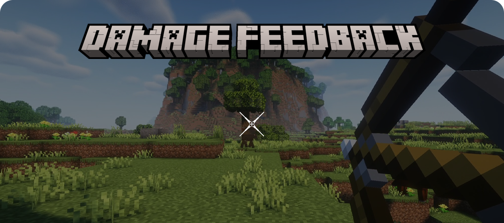

    
      
    To download this mod's JAR file, go to the folder corresponding to your Minecraft version, in this Repository, like "Forge-XX.XX.XX-JARs". All JAR versions of this mod will be located there.

# About this Mod

This mod was created with the primary intention of simply providing audio feedback of "ding" to the Player Client when firing an Arrow that hit any Creature. However, the mod quickly evolved into something a bit more complex and adds a lot to Minecraft gameplay!

Inspired by Overwatch's Damage Feedback system, this mod displays an "X" on the Player's reticle whenever they deal Direct Damage to a Creature/Player. This Direct Damage can be, for example, damage from a Sword, Arrow, Trident, or anything else that can be used for a Player to deal Direct Damage to another Creature. The "X" increases in size as the Player delivers a series of hits to the victim. If the Player's target Creature is eliminated, a skull briefly appears over the reticle, confirming its kill. See the image below, paying attention to the reticle, for an example:

Whenever the "X" appears, you also receive a slight "tick" sound feedback to enhance the feeling of damage applied to the victim. Now, see the damage feedback working for Arrows:

When an arrow hits a victim, instead of the "tick" sound when the "X" appears, you hear a "ding" sound. All the feedback sounds has been implemented in a way that definitely won't become tiresome after hours and hours of gameplay. Normally, Arrow hit feedback mods play the hit sound at the location where the victim was struck. The problem with this is that for medium/long shots, the attacker doesn't hear the sound. However, with this mod, things are different. When the Server detects a hit, it makes the attacker's Client play the sound in the UI, ensuring that the attacker ALWAYS hears the hit feedback sound.

This mod also features an extended last attacker tracking system. This means that if you hit a Creature, you will receive all the Damage Feedback that Creature suffers in the next 30 seconds or until another Player hits it. This means, for example, that if you hit a Creature and it falls off a cliff, you will see the "X" of your hit, and when the Creature hits the ground, you will receive the "X" corresponding to the fall damage it suffered. And if it dies in the next few seconds, the Skull will appear on your reticle, indicating that the Creature died.

Thanks to this extended tracking system, this mod also attempts to track certain types of Indirect Damage, in addition to the damage the Creature suffered after you hit it. An example of Indirect Damage without first contact is when you throw a Poison Potion at a Creature without hitting it. Since you didn't hit it, there's no record of the last attacker, but the mod is smart enough to understand that you were the player who threw poison at it. Therefore, you will receive feedback, as you can see below:

Another example is when you deliberately set a Creature on fire using a Flint and Steel:

That's all! If you want, you can also configure the Damage Feedback colors for this mod. These properties are easily accessible through the configuration file.

# Compatibility

This mod requires Minecraft Java with Forge Mod Loader installed. You can see the supported Minecraft versions in the folders of this Repository.

Minimum required Forge version:
- For Minecraft 1.20.1 is 47.2.0

# Support projects like this

If you liked the Damage Feedback and found it useful for your, please consider making a donation (if possible). This would make it even more possible for me to create and continue to maintain projects like this, but if you cannot make a donation, it is still a pleasure for you to use it! Thanks! 😀

 

    

